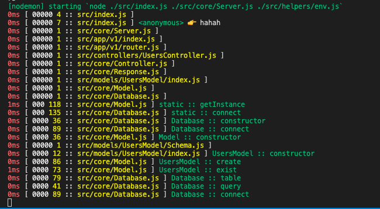

# node-log
Log file path and method called to terminal nodejs

## Usage

This package only support Node environment.

Only import/require from main file of project.

With JavaScript:

```js
// src/index.js
require('@kensoni/log');

// More code here
```

With Typescript:

```ts
// src/index.ts
import '@kensoni/log';

// More code here
```

Call `__log()` function anywhere that you want to show log.

```js
__log();
```

Using as `console.log`:

```js
__log(msg1, msg2, msg3, ...);
```

The format log message show to terminal

```
<time>ms [ <000> <line> :: <file path> ] <method> 👉 <message passed>
```

Demo: 



## Note

This package always shows the log whether the environment is production or development.

To disable this feature without removing the code make sure that `process.env.DEBUG_LOG_DISABLED` flag is a truthy.

To change length of zero before `line` value. Let set `process.env.DEBUG_LOG_MIN_COLUMNS` (default: `6`). If value less than 6, it will use default value.

This function with replace `console.log` if `process.env.DEBUG_LOG_REPLACE_CONSOLE` is truthy.